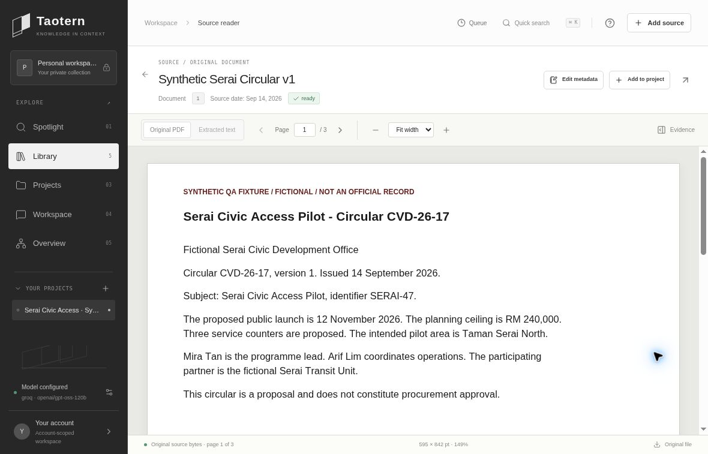

# Taotern — Knowledge in context

**Turn scattered documents into organized projects and source-cited answers, with original evidence within reach.**

## Team

**Taotern**
- Daniel Ong Zhi En
- You Zheng

Built for AWS Community Day Kuching 2026.

## Demo

https://taotern-kuching-2026.liuyz8715.chatgpt.site/

Sign in with a ChatGPT account. Each account has an isolated workspace. Use public or synthetic documents with the demonstration AI provider; model calls are quota-limited.

## What it does and who it is for

Taotern helps students, researchers and teams turn scattered documents into a focused evidence workspace. Upload original files, organize them into Projects, and consult an LLM about selected sources. Page-linked references lead back to the original document so users can check the answer.

The final demonstration focuses on **Upload → Projects → Workspace consultation**.

- Preserve original documents and display real PDF pages in a central reader
- Extract native text from searchable PDF, TXT and Markdown for search and AI
- Keep uploads even when text extraction is **NOT SUPPORTED**; use external OCR to make scanned material searchable
- Clearly mark partial text coverage; unreadable pages are not silently treated as evidence
- Organize documents into Projects and choose the evidence scope for each question
- Return source-cited answers and open the cited original page

OCR is not built into this release. Additional analysis tools are experimental and are not part of the narrowed final acceptance claim.

## Quick demo flow

1. Create a Project.
2. Upload a native-text PDF or TXT/Markdown and assign it to that Project.
3. Open the document: inspect its original pages, pagination and zoom.
4. Open the Project Workspace, select ready sources and ask a question.
5. Click the answer's source references and compare them with the original pages.

Synthetic demo examples compare two circular versions: proposed launch 12 → 19 November 2026, planning ceiling RM 240,000 → RM 210,000 and service counters 3 → 2; neither version grants procurement approval. These are explicitly fictional fixtures, not real organizational records.

## Actual product screenshot

This is an actual deployed product capture with labeled synthetic documents, not a mockup. Later compact-header and typography changes may differ slightly from this captured view.

## Source and architecture

The authoritative handoff is **taotern-source.zip**. SHA256: `4116ff6062af63b615142eb0681fddd7c8cd00bc7d28d0dd8a53c3dd71af741f`. This package includes the final native-only intake, compact original-PDF reader and OpenRouter Qwen integration. Extract it to a clean directory; do not mix it with the older native app tree or paused Docker checkpoint. The archive contains source, dependency lockfile, migrations, tests and provenance documentation, without API keys or user documents.

React/TypeScript UI, server-side document and AI routes, persistent document metadata and original-file storage. The configured generation model is OpenRouter `qwen/qwen3.6-35b-a3b`. Credentials are server Secrets, never browser source or repository files. Its real health check passed; application quotas and a conservative lifetime spending guard remain enforced. The demonstration runs on GPT-Site; the earlier local Docker direction is paused.

Inside the extracted source, install dependencies with `npm ci`, then run `npm run build`. Deployment requires the documented runtime/storage bindings and server-side provider configuration; secrets are not included.

## Verification and limitations

Actual checks include fresh native-text upload/readback, Project-scoped saved sources, original-PDF reader/page/zoom/citation navigation, persistence across deployment, and a successful three-document comparison with exact source references. The final native-only upload/partial-page rules also have parser and HTTP regression coverage. New provider switching is validated separately; a configured key alone is not proof of a working API call.

See `docs/ACCEPTANCE.md` and `RECOVERY.md` in the source package for detailed evidence and explicit limits. AI answers can still be incomplete or mistaken; verify cited sources.
